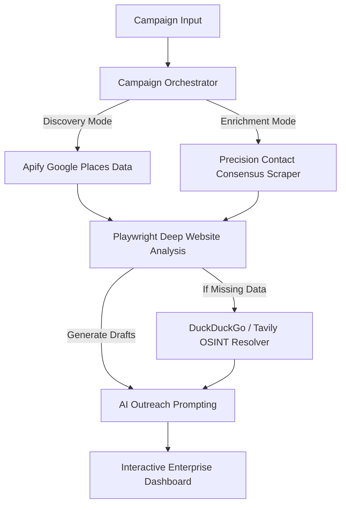

# 🌌 Outreach Intelligence System (OIS)

**The Multi-Agent Lead Research & Outreach Pipeline.**

OIS is a high-performance, resilient AI pipeline designed to transform raw queries or lead lists into deeply researched business intelligence and hyper-personalized outreach campaigns. It dynamically scores leads based on precise scraping consensus, Playwright automation, and OSINT logic.

---

## 🏗️ Intelligence Architecture



## ✨ Key Features

- **Dual-Mode Pipeline:** 
  - **Discovery:** Given a raw prompt, extracts hundreds of high-quality local leads combining Google Maps logic and deep website crawling.
  - **Enrichment:** Upload an Excel/CSV file to run deep consensus contact scraping (merging 5+ sources to find the most verifiable phone numbers and WhatsApps).
- **Playwright Booking & Tech Analysis:** Automatically parses modern web apps (`__next`, `React`, `Shopify`) vs static HTML configurations, and extracts hidden, custom "Book Now" flows automatically.
- **Vercel + Browserless Ready:** Architecture supports both local headless Chromium and remote Browserless.io execution, eliminating Vercel function-size and memory limits out of the box.
- **Pydantic v2.7 Hardened Models:** State-of-the-art fallback validation routing, catching deep assignment errors instantly before rendering.
- **Premium Dashboard UI:** A data-dense, cinematic interface featuring real-time interactive filters, "Slide-Over" data inspection panels, and one-click outreach batching.

---

## 🚀 Getting Started

### 1. Prerequisites
- Python 3.10+
- **APIFY_TOKEN** ([Google Maps Scraper](https://apify.com/compass/crawler-google-places))
- **TAVILY_API_KEY** ([OSINT Fallback Search](https://tavily.com/))
- **LLM_API_KEY** (OpenAI / Groq / Anthropic)
- *(Optional)* **BROWSERLESS_WS_URL** (For Vercel remote scraping)

### 2. Installation
```bash
# Clone the repository
git clone https://github.com/muhamedamil/Outreach-Intelligence-System.git
cd Outreach-Intelligence-System

# Create virtual environment
python -m venv venv
source venv/bin/activate  # On Windows: venv\Scripts\activate

# Install dependencies
pip install -r requirements.txt

# Install Playwright browsers (Required for local web operations)
playwright install
```

### 3. Environment Setup
Create a `.env` file in the root directory (refer to `.env.example`):
```env
LLM_API_KEY=sk-...
TAVILY_API_KEY=tvly-...
APIFY_TOKEN=apify_api_...
```

### 4. Running the Application (Local Development)
**CRITICAL:** Launch the application using the custom entry point `run.py`. Do NOT start via `uvicorn app.main:app --reload` as the reload flag forces a `SelectorEventLoop` on Windows overriding the required `ProactorEventLoop`, which causes Playwright dependencies to crash. 

```bash
python run.py
```
Visit `http://127.0.0.1:8001` to access the command center.

---

## ☁️ Deployment (Vercel)

This project has been explicitly hardened to deploy successfully on Vercel's Serverless environment despite heavy browser requirements.

1. Create a [Browserless.io](https://www.browserless.io) account and copy your WebSocket API URL.
2. In your Vercel Project Settings, add all your environment variables including:
   `BROWSERLESS_WS_URL=wss://chrome.browserless.io?token=<YOUR_TOKEN>`
3. The included `vercel.json` automatically stretches API request limits (`maxDuration: 60` for Free/Hobby accounts) giving the Playwright engines enough time to process batches dynamically.

---

## 📁 Project Structure

| Directory | Responsibility |
|-----------|----------------|
| `app/api/` | FastAPI routers and endpoint handlers. |
| `app/models/`| Pydantic v2.7 data models (LeadProfile, Consensus). |
| `app/services/campaign/` | Pipeline logic (`DISCOVERY` vs `ENRICHMENT`). |
| `app/services/scraper/` | Playwright analyzer, OSINT resolver, and contact consensus. |
| `app/services/gmaps/` | Apify client integration. |
| `frontend/` | Dashboard interface, filter engines, and state management. |

---

## 🛠️ Configuration Tuning (`app/config/settings.py`)

- **Worker Processes:** `run.py` launches 4 parallel workers so the UI never locks during intense background operations.
- **Scraper Concurrency:** Change `SCRAPER_CONCURRENCY` to control how many simultaneous Playwright instances launch (reduce to 1 or 2 for lightweight cloud environments).
- **Timeouts:** Granular control over OSINT latency vs DOM rendering.
