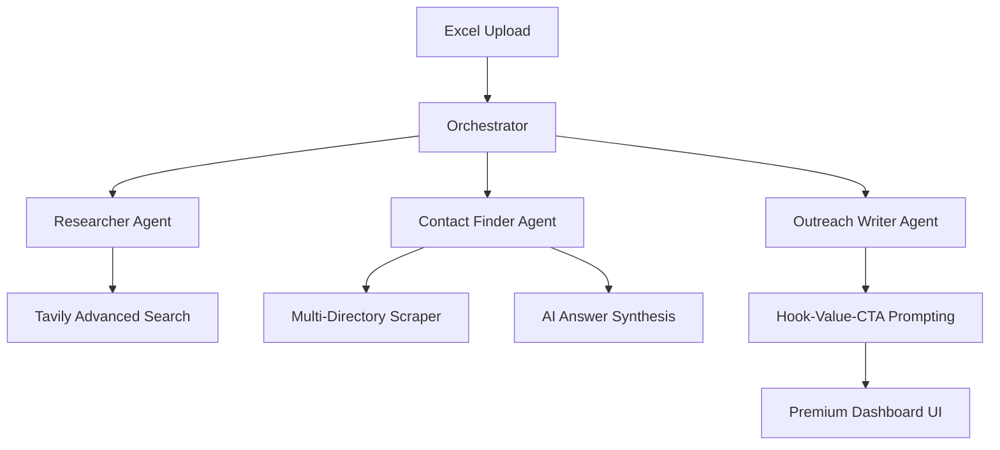

# 🌌Outreach Intelligence System

**The Standard Multi-Agent Lead Research & Outreach Pipeline.**

OIS is a high-performance, resilient AI pipeline designed to transform raw lead lists into deeply researched business intelligence and hyper-personalized outreach campaigns. It bypasses traditional scraping barriers using advanced AI synthesis and multi-agent coordination.

---

## 🏗️ System Architecture



## ✨ Key Features

- **🛡️ "Very Strict" Contact Discovery:** Multi-layer validation that filters out generic emails (a@gmail.com) and enforces valid 10-digit phone normalization.
- **🔍 Tavily Advanced Integration:** Leverages AI-synthesized answers and deep research depth to bypass "Click to Reveal" bot protection on high-authority sites.
- **🎨 Premium Dashboard UI:** A stunning, data-dense interface built with modern typography, glassmorphism design, and real-time processing stats via an interactive command center.
- **⚡ High-Concurrency Processing:** Built with FastAPI and advanced async patterns (multiple workers) to handle large lead lists with zero server lockups during long-running background tasks.
- **📱 One-Click Outreach:** Integrated WhatsApp direct links and a "Copy Terminal" for rapid manual outreach.

---

## 🚀 Getting Started

### 1. Prerequisites
- Python 3.10+
- Tavily API Key ([Get one here](https://tavily.com/))
- LLM API Key (OpenAI/Groq/OpenRouter)

### 2. Installation
```bash
# Clone the repository
git clone https://github.com/muhamedamil/Outreach-Intelligence-System.git
cd Outreach-Intelligence-System

# Create virtual environment
python -m venv venv
source venv/bin/activate  # On Windows: venv\Scripts\activate

# Install dependencies
pip install -r requirements.txt

# Install Playwright browsers (Required for web operations)
playwright install
```

### 3. Environment Setup
Create a `.env` file in the root directory (refer to `.env.example`):
```env
LLM_API_KEY=sk-...
TAVILY_API_KEY=tvly-...
```

### 4. Running the Application
**CRITICAL:** Launch the application using the custom entry point `run.py`. Do NOT start via `uvicorn app.main:app --reload` as the reload flag forces a `SelectorEventLoop` on Windows overriding the required `ProactorEventLoop`, which causes Playwright dependencies to crash. `run.py` handles this automatically alongside spinning up required background workers.

```bash
python run.py
```
Visit `http://127.0.0.1:8001` to access the high-end enterprise dashboard and interactive UI pipeline. 

---

## 📁 Project Structure

| Directory | Responsibility |
|-----------|----------------|
| `app/agents` | Brain logic (Researcher, Contact Finder, Writer). |
| `app/orchestrator` | Parallel execution and error handling logic. |
| `app/services` | Base scrapers (Playwright based), LLM clients, and File processors. |
| `app/api` | FastAPI routes and request handling. |
| `frontend/` | Dashboard UI (HTML/CSS/JS). |

---

## 🛠️ Configuration (Strictness & Timeouts)

- **Worker Processes:** Defaults to 4 parallel workers. Allows UI to remain responsive while running headless operations.
- **Agent Timeout:** 300s (to allow deep research on slow directory sites).
- **API Timeout:** 3600s (global lifespan for large Excel batch processing).
- **Scraper Headers:** Mimics modern Chrome browsers to minimize bot detection.

---

