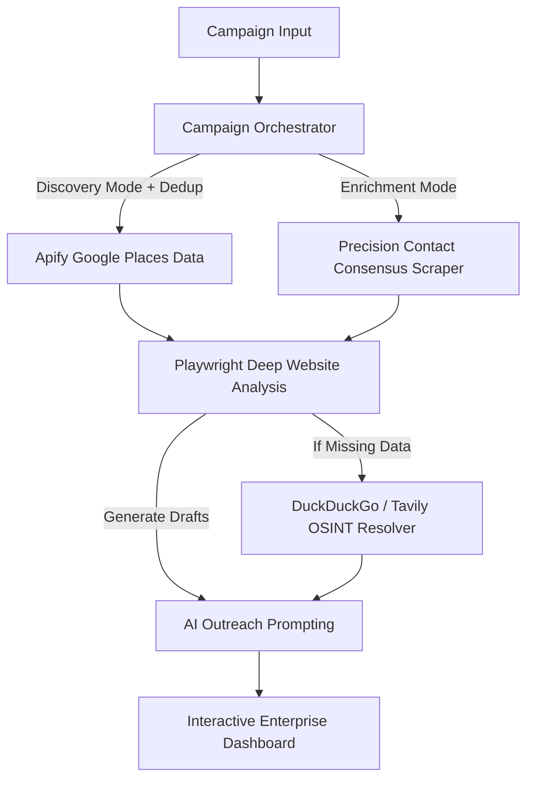

# 🌌 Outreach Intelligence System (OIS)

**The Multi-Agent Lead Research & Outreach Pipeline.**

OIS is a high-performance, resilient AI pipeline designed to transform raw queries or lead lists into deeply researched business intelligence and hyper-personalized outreach campaigns. It dynamically scores leads based on precise scraping consensus, Playwright automation, and OSINT logic.

---

## 🏗️ Intelligence Architecture



## ✨ Key Features

- **Dual-Mode Pipeline:**
  - **Discovery:** Given a raw prompt, extracts hundreds of high-quality local leads combining Google Maps logic and deep website crawling.
  - **Enrichment:** Upload an Excel/CSV file to run deep consensus contact scraping (merging 5+ sources).
- **Production URL Intelligence:** A multi-layer scoring engine that prioritizes official business websites, skips 80+ known directory "traps" (JustDial, IndiaMart, SolarMango), and surgical path-crawls only `/contact` or `/about` pages to minimize footprint.
- **Advanced Lead Deduplication:**
  - **Identity Protection:** Uses Google's immutable `Place ID` as a primary fingerprint.
  - **Fuzzy Fallback:** Uses name+city slugging to catch duplicates across sources with inconsistent formatting.
  - **Overshoot Buffering:** Automatically doubles the search breadth when a "seen leads" file is uploaded to ensure a consistent volume of *new* results.
- **JustDial/IndiaMart OSINT Fallback:** Specialized scraping logic that extracts phone numbers directly from search snippets for businesses with zero digital presence.
- **Playwright Booking & Tech Analysis:** Automatically parses modern web apps (`__next`, `React`, `Shopify`) and extracts custom "Book Now" flows.
- **Vercel + Browserless Ready:** Architecture supports both local headless Chromium and remote Browserless.io execution.
- **Premium Dashboard UI:** A data-dense, cinematic interface featuring real-time filters, "Slide-Over" data inspection, and one-click outreach batching.

---

## 🚀 Getting Started

### 1. Prerequisites

- Python 3.10+
- **APIFY_TOKEN** ([Google Maps Scraper](https://apify.com/compass/crawler-google-places))
- **TAVILY_API_KEY** ([OSINT Fallback Search](https://tavily.com/))
- **LLM_API_KEY** (OpenAI / Groq / Anthropic)
- *(Optional)* **BROWSERLESS_WS_URL** (For Vercel remote scraping)

### 2. Installation

```bash
# Clone the repository
git clone https://github.com/muhamedamil/Outreach-Intelligence-System.git
cd Outreach-Intelligence-System

# Create virtual environment
python -m venv venv
source venv/bin/activate  # On Windows: venv\Scripts\activate

# Install dependencies
pip install -r requirements.txt

# Install Playwright browsers (Required for local web operations)
playwright install
```

### 3. Environment Setup

Create a `.env` file in the root directory:

```env
LLM_API_KEY=sk-...
TAVILY_API_KEY=tvly-...
APIFY_TOKEN=apify_api_...
```

### 4. Running the Application (Local Development)

**CRITICAL:** Launch the application using the custom entry point `run.py`. Do NOT start via `uvicorn app.main:app --reload` as the reload flag overrides the required `ProactorEventLoop` on Windows.

```bash
python run.py
```

Visit `http://127.0.0.1:8001` to access the command center.

---

## ☁️ Deployment (Vercel)

This project has been explicitly hardened for Vercel's Serverless environment.

1. Create a [Browserless.io](https://www.browserless.io) account and copy your WebSocket API URL.
2. In your Vercel Project Settings, add all your environment variables including:
   `BROWSERLESS_WS_URL=wss://chrome.browserless.io?token=<YOUR_TOKEN>`
3. The included `vercel.json` configures `maxDuration: 60` giving the engines enough time to process batches dynamically.

---

## 📁 Project Structure

| Directory | Responsibility |
| :--- | :--- |
| `app/api/` | FastAPI routers and endpoint handlers. |
| `app/models/` | Pydantic v2.7 data models (LeadProfile, Consensus). |
| `app/services/campaign/` | Pipeline logic (`DISCOVERY` vs `ENRICHMENT`). |
| `app/services/dedup/` | CSV-based lead deduplication engine. |
| `app/services/scraper/` | Playwright analyzer, URL Intelligence, and directory OSINT. |
| `app/services/gmaps/` | Apify client integration. |
| `frontend/` | Dashboard interface, filter engines, and state management. |

---

## 🛠️ Configuration Tuning (`app/config/settings.py`)

- **Worker Processes:** `run.py` launches 4 parallel workers.
- **Scraper Concurrency:** Change `SCRAPER_CONCURRENCY` to control simultaneous Playwright instances.
- **Timeouts:** Granular control over OSINT latency vs DOM rendering.
